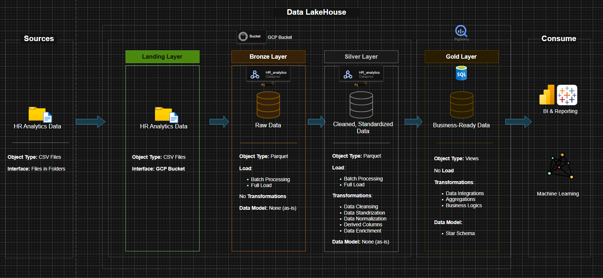

## HR Analytics Data Lakehouse (GCP)

**Project Objective**

The primary objective of this project is to centralize and normalize HR information to provide a "Single Source of Truth." By transforming raw data into a structured Lakehouse format, we enable data scientists and analysts to perform deep-dive attrition analysis and predictive modeling without the overhead of manual data preparation.

**Architecture Overview**

The architecture follows the Medallion (Multi-Hop) Design, leveraging GCP-native services:

**Ingestion (Sources):**

Raw HR CSV files uploaded to the Landing Layer using 

`gcloud storage cp`.

In the `setup.sh` file.

**Bronze Layer:**

Data is converted to Parquet format to optimize storage and read performance, and some metadata added (load_date, source). No transformations occur here to preserve original data state.

**Silver Layer:**
 
PySpark jobs running on GCP Dataproc perform:

- Data Cleansing & Standardization (handling nulls, uniform casing).

- Derived Columns (calculating tenure, age buckets).

- Normalization of employee attributes.

**Gold Layer:**
 
Business-logic-heavy BigQuery Views structured in a Star Schema. This layer is optimized for BI Tools (Power BI/Looker)

## 🛠 Infrastructure (Provisioned via Terraform)

This project leverages a managed GCP stack to ensure low maintenance and cost-efficiency:

* **Google Cloud Storage (GCS):** 3-Bucket system (`landing`, `bronze`, `silver`) with lifecycle policies to archive old data and 2 buckets for dataproc (`staging`, `temp`).
* **Dataproc Workflow Templates:** Orchestrates PySpark jobs without a persistent cluster
* **BigQuery:** Serving layer hosting `vw_` (views) and `ext_` (external tables) to enable SQL-based analytics on top of the GCS Data Lake.
* **Cloud Scheduler:** A cron-based trigger configured for daily 02:00 UTC execution.
* **IAM & Service Accounts:** Granular "Principle of Least Privilege" access control for the ETL runner and the Scheduler.

**Tech Stack**

- Cloud Provider: Google Cloud Platform (GCP)

- Storage: Google Cloud Storage (GCS)

- Processing Engine: Apache Spark (PySpark) on Dataproc

- Data Warehouse: BigQuery

- Infrastructure as Code: Terraform

- Language: Python, SQL

**Getting Started**